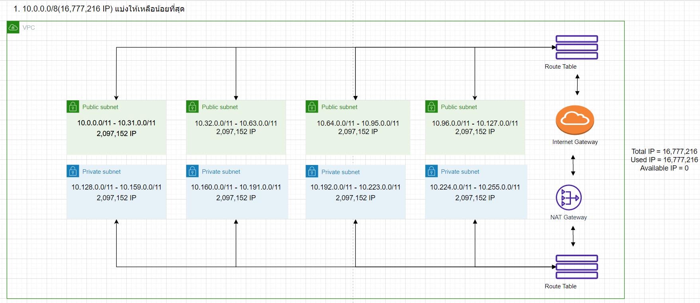
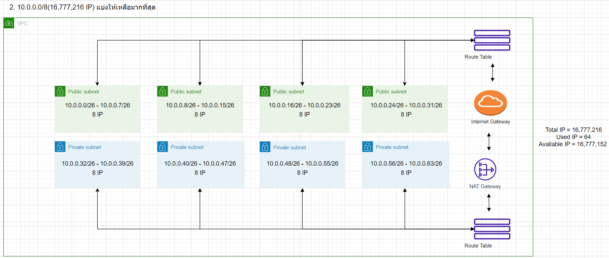

# **LAB Assignment 5**
### 1.กำหนดให้ VPC มี CIDR range 10.0.0.0/8 จงออกแบบ subnet(vswitch) ตามรายละเอียดดังนี้
    1.1 public 4 zone พร้อมระบุจำนวน ip ที่ใช้ได้
    - IP ทั้งหมด 16,777,216/2 = 8,388,608 ใช้ public ได้ Zone ละ 2,097,152 - 2 = 2,097,150 IP รวมทั้งหมด 2,097,150*4 = 8,388,600 IP
    1.2 private: 4 zone พร้อมระบุจำนวน ip ที่ใช้ได้
    - IP ทั้งหมด 16,777,216/2 = 8,388,608 ใช้ private ได้ Zone ละ 2,097,152 - 2 = 2,097,150 IP รวมทั้งหมด 2,097,150*4 = 8,388,600 IP
    1.3 ระบุจำนวน ip ที่ยังเหลือ
    - เหลือ 0 IP
    
* เงื่อนไข: ให้เหลือจำนวน Available IPs น้อยที่สุด

### 2.กำหนดให้ VPC มี CIDR range 10.0.0.0/8 จงออกแบบ subnet(vswitch) ตามรายละเอียดดังนี้
    2.1 public 4 zone พร้อมระบุจำนวน ip ที่ใช้ได้
    - IP ทั้งหมด 16,777,216/2 = 8,388,608 ใช้ public ไป Zone ละ 8 - 2 = 6 IP รวมทั้งหมด 6*4 = 24 IP รวมกับ Boardcast IP กับ Network IP เป็น 32
    2.2 private: 4 zone พร้อมระบุจำนวน ip ที่ใช้ได้
    - IP ทั้งหมด 16,777,216/2 = 8,388,608 ใช้ private ไป Zone ละ 8 - 2 = 6 IP รวมทั้งหมด 6*4 = 24 IP รวมกับ Boardcast IP กับ Network IP เป็น 32
    2.3ระบุจำนวน ip ที่ยังเหลือ
    - เหลืออยู่ 16,777,216 - 64 = 16,777,152 IP

* เงื่อนไข: ให้เหลือจำนวน Available IPs มากที่สุด

